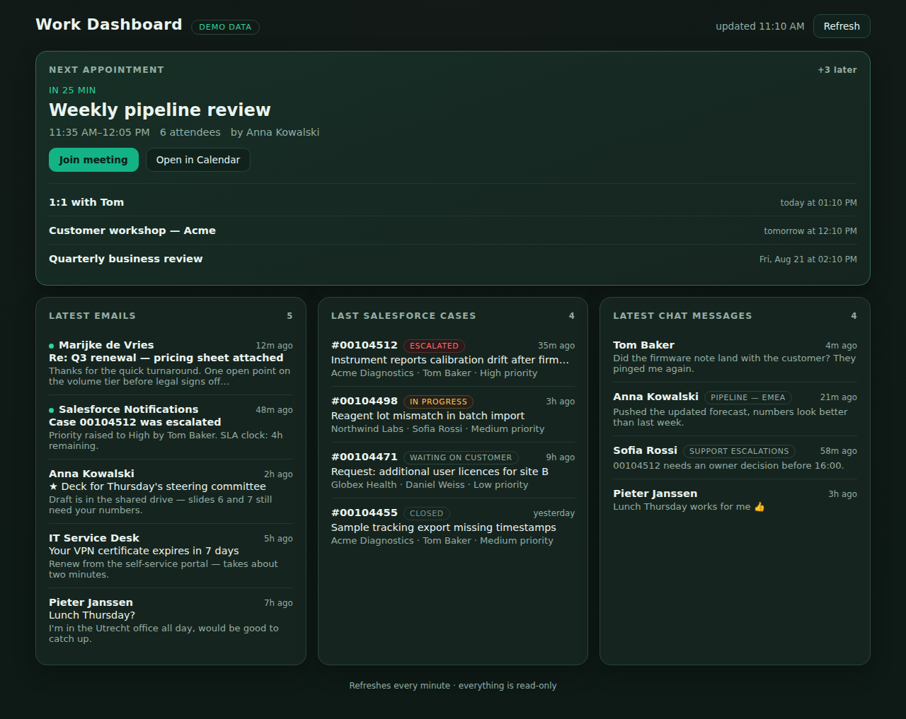

# Work Dashboard

One screen, four answers:

* **Latest emails** — Gmail inbox, unread marked
* **Next appointment** — the very next thing on your calendar, with a countdown, a Join button, and what follows it
* **Last cases in Salesforce** — most recently touched cases, with status and priority
* **Latest chat messages** — newest Google Chat messages across your spaces and DMs

Everything is **read-only**. The app runs on your own machine, talks straight to
Google and Salesforce, and stores nothing anywhere else.



| File | What it is |
| --- | --- |
| `server.py` | Local server + OAuth endpoints + the API calls. **This is what you run.** |
| `auth.py` | OAuth 2.0 (authorization code + PKCE) and the token store. |
| `sources.py` | The four feeds: Gmail, Calendar, Chat, Salesforce. |
| `httpclient.py` | Tiny JSON-over-HTTPS helper. |
| `demo.py` | Sample data for `?demo`. |
| `index.html` / `app.js` | The UI. |

Python 3.9+, standard library only — no `pip install`, no build step.

## Try it in ten seconds

```bash
python3 server.py --demo
```

Opens <http://localhost:8766/?demo> with realistic sample data, so you can see
the whole thing before handing over any credentials.

## Run it for real

```bash
cp config.example.json config.json   # then fill in the two client ids
python3 server.py
```

Open <http://localhost:8766>, click **Connect Google Workspace** and **Connect
Salesforce** once, and you're done — refresh tokens are kept in `tokens.json`
(chmod 600, gitignored) so you never log in again.

### Google Workspace (email, calendar, chat)

In the [Google Cloud console](https://console.cloud.google.com), on any project:

1. **Enable three APIs** — *Gmail API*, *Google Calendar API*, *Google Chat API*.
2. **OAuth consent screen** → *Internal* if this is your work Workspace account
   (otherwise *External*, and add yourself as a test user). Add these scopes:

   ```
   .../auth/gmail.readonly
   .../auth/calendar.readonly
   .../auth/chat.spaces.readonly
   .../auth/chat.messages.readonly
   ```

3. **Credentials → Create credentials → OAuth client ID → Web application**, with
   this authorized redirect URI, exactly:

   ```
   http://localhost:8766/auth/google/callback
   ```

4. Put the client ID and secret in `config.json` under `google`.

### Salesforce (cases)

In **Setup → App Manager → New Connected App**:

1. Tick **Enable OAuth Settings**, callback URL:

   ```
   http://localhost:8766/auth/salesforce/callback
   ```

2. Selected scopes: **Manage user data via APIs (`api`)** and **Perform requests
   at any time (`refresh_token`, `offline_access`)**.
3. Leave **Require Proof Key for Code Exchange (PKCE)** enabled — the app sends it.
4. Copy the consumer key/secret into `config.json` under `salesforce`. If you turn
   *Require Secret for Web Server Flow* off, leave `client_secret` empty.
5. Set `login_url` to `https://login.salesforce.com`, or `https://test.salesforce.com`
   for a sandbox, or your My Domain URL.

A brand-new connected app can take ~10 minutes before it accepts logins.

## Configuration (`config.json`)

| Key | Default | What it does |
| --- | --- | --- |
| `salesforce.mine_only` | `false` | Show only cases you own, instead of every case you can see. |
| `salesforce.api_version` | `v61.0` | Salesforce REST API version. |
| `limits.emails` / `.events` / `.chats` / `.cases` | 8 / 4 / 8 / 8 | How many rows per card. |

Anything in `config.json` can also come from the environment — handy if you'd
rather not keep secrets in a file:

```
GOOGLE_CLIENT_ID  GOOGLE_CLIENT_SECRET
SF_CLIENT_ID      SF_CLIENT_SECRET      SF_LOGIN_URL      SF_API_VERSION
DASHBOARD_PORT    DASHBOARD_CONFIG      DASHBOARD_TOKENS
```

## How it hangs together

The browser only ever talks to `localhost`. `server.py` holds the tokens and
makes the Google and Salesforce calls itself, which sidesteps CORS entirely and
keeps access tokens out of the page. The four feeds are fetched in parallel and
each one is wrapped on its own, so a Salesforce outage or an expired Google
grant costs you that one card and nothing else — the card tells you what broke
and offers a **Connect** link when reconnecting is the fix.

The page refreshes every minute, pauses while the tab is in the background, and
re-renders the countdown on the next appointment every 30 seconds in between.

## Troubleshooting

**"Not connected to … yet" that won't go away** — the OAuth grant was revoked or
expired. Click Connect again; `tokens.json` is rewritten.

**Chat card returns 403** — check the *Google Chat API* is enabled on the project
and that your Workspace admin permits Chat API access for user accounts.

**`redirect_uri_mismatch`** — the URI in the Google/Salesforce client must match
`http://localhost:8766/auth/<provider>/callback` character for character. If you
changed `DASHBOARD_PORT`, update the registered URI to match.

**Emails or cases look stale** — hit Refresh; the countdown ticks on its own but
the feeds only reload once a minute.
